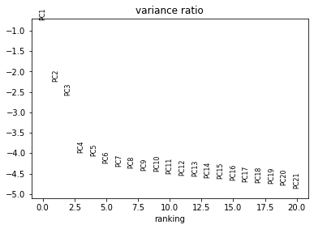
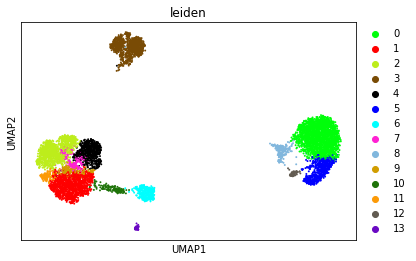
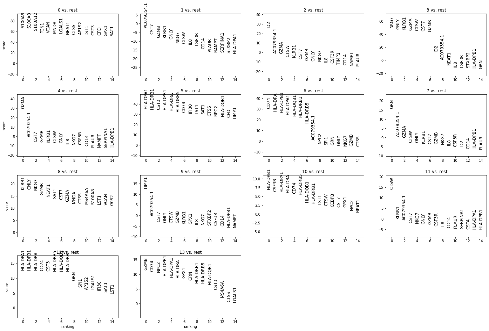
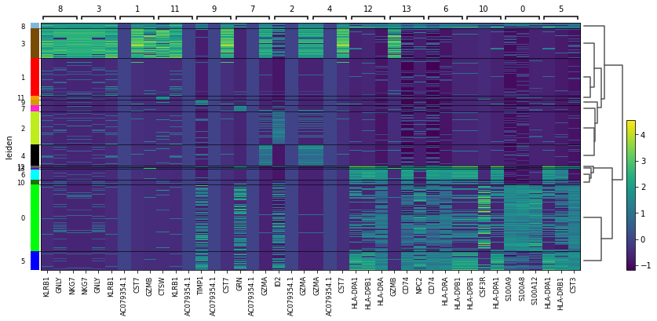
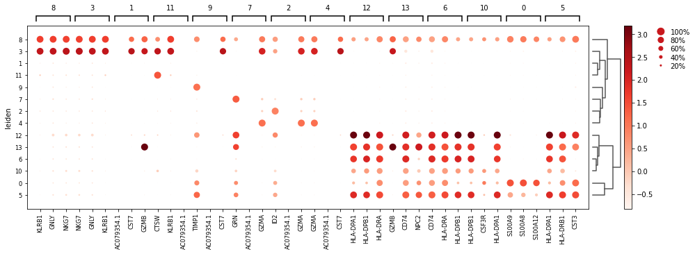
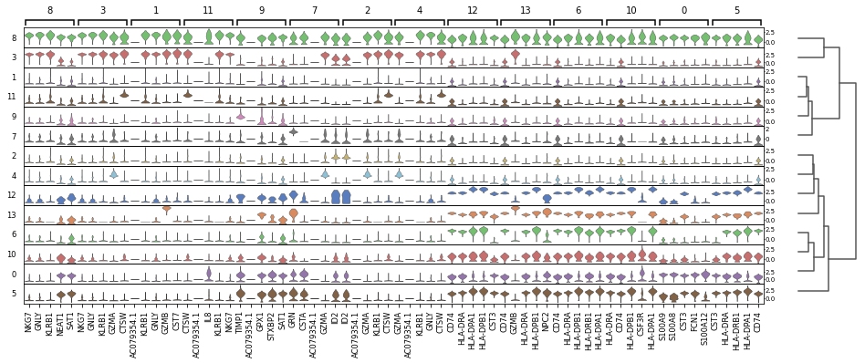
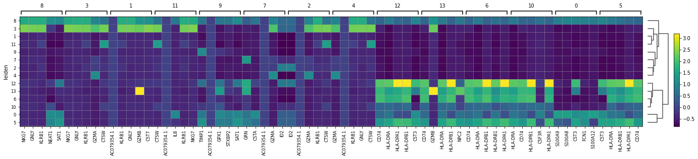
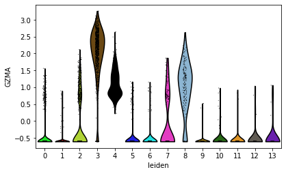

# Introduction to sc-REnF (CBMC Data)

An Entropy Based Feature Selection- Application on Single cell RNA Sequence Data

# Summary


A novel and Robust Entropy based Feature (gene) Selection method for large Single-cell RNA-seq data, using  Renyi ´and Tsallis entropy. The SC-REnF is also demonstrated for identifying marker genes from different cell types. Our results shed some light on the single-cell clustering problem with the application of entropy based feature selection, and therefore, it will be an important tool to complement existing methods in the scRNA-seq analysis pipeline. Results are shown here in brief.


# How to use sc-REnF

## Data Loading and Preprocessing


Load the Libraries

```
library(SingleCellExperiment)
library('Linnorm')

#normalized_data function is in DataProcessing.R function
annotation <- Biase_data[[2]] #already factor type class
colnames(data) <- as.matrix(annotation)
PreprocessedData = normalized_data(data)

```

We will give the method demonstration on CBMC data. For more details about the data, see [Simultaneous epitope and transcriptome measurement in single cells](https://www.nature.com/articles/nmeth.4380)

For demonstration purposes, we gave here the preprocessed CBMC data and cell types. One can download the other datasets from above link, and preprocess it using given code.
For preprocessing, Genes should be in row, Cells should be in coloumn


```
data= as.matrix(read.csv("cbmcdata.csv",header=FALSE))
cell=as.matrix(read.csv("cbmcannot.csv",header = FALSE))
gene=as.matrix(read.csv("cbmc_gene.csv",header=FALSE))

```

```
dim(data) 
[1] 7895    2000

data[1:2,1:3]
                V1            V2           V3
1              10.00000000  4.6159939 -0.08952736
2              -0.04300511 -0.1279653 -0.08952736
```

A total of 7895 cells and 2000 genes are remaining in the dataset after cell, gene filtering, and Normalization.


## Feature (Gene Selection)

Load the libraries

```
library(foreach)
library(doParallel)
library('scREnF')
```
Apply the feature (gene) selection using Renyi and Tsallis with preprocesse data and cell types. Default--- Core Number (p=40), q-values (q=0.7,0.3) , Number of genes to be selected (nf=500). For Gene selection, Cells should be in row and genes should be in coloumn. Header should be null.

```
RenyiFeadata=Renyifeature(data,cell,gene,p,q,nf)
TsallisFeadata=Tsallisfeature(data,cell,gene,p,q,nf)
```

The  Reduced CBMC data using Renyi entropy

```
dim(RenyiFeadata)
[1] 7895  500
RenyiFeadata[1:2,1:3]
            PTN            PRIM1          PLA2G12A      
Eryth "-0.102047271" " 1.738611217" " 2.505624603"
Eryth "-0.102047271" " 1.214342009" " 1.556973317"
```

The  Reduced CBMC data using Tsallis entropy

```
dim(TsallisFeadata)
[1] 7895  500
TsallisFeadata[1:2,1:3]
            AC079354.1     CST3           NKG7          
Eryth "-0.020573752" "-0.334792659" "-0.396311788"
Eryth "-0.020573752" " 0.172185618" "-0.343284490"
```
## Saving the results

```
write.csv(TsallisFeadata, file="Tsallisd.csv")
write.csv(RenyiFeadata, file="Renyid.csv.csv")
```

## Clustering using selected feature

import libraries in python and importing the data

```
import numpy as np
import pandas as pd
import scanpy as sc
adata1=sc.read_csv('Renyid.csv', delimiter=',', first_column_names=None, dtype='float32')
```

Using PCA dimensionality reduction and Leiden clustering

```
sc.tl.pca(adata1, svd_solver='arpack')
sc.pl.pca_variance_ratio(adata1,n_pcs=20,log=True)
```



```
#create neighborhood graph using 10 pcs 
sc.pp.neighbors(adata1, n_neighbors=15, n_pcs=10)
##dim reduction using umap
sc.tl.umap(adata1)
#Leiden clustering
import leidenalg
sc.tl.leiden(adata1)
##visualizing clusters
sc.pl.umap(adata1, color=['leiden'])
```


save the clustering results

```
pd.DataFrame(adata1.obs).to_csv("cbmc_leiden.csv")
```


## Marker selection form identified clusters

Compute a ranking for the highly differential genes in each cluster using Wilcoxon-RankSum test

```
sc.tl.rank_genes_groups(adata1, 'leiden', method='wilcoxon',key_added = "wilcoxon")
sc.pl.rank_genes_groups(adata1, n_genes=30, sharey=False,key="wilcoxon")
```



Top 10 DE genes for each cluster using Wilcox-Ranksum Test

```
#save top 10 DE genes for each cluster using wilcox-ranksum test
result = adata1.uns['wilcoxon']
groups = result['names'].dtype.names
p=pd.DataFrame(
    {group + '_' + key[:1]: result[key][group]
    for group in groups for key in ['names', 'pvals']}).head(10)
pd.DataFrame(p).to_csv("cbmc_marker.csv")
```
Visualizing top 5 DE genes for each cluster in a heatmap using wilcox results

```
sc.pl.rank_genes_groups_heatmap(adata1, n_genes=5, key="wilcoxon", groupby="leiden", show_gene_labels=True)
```


Visualizing top 5 DE genes for each cluster in a dotplot using t-test results. Here color of dot represents mean expression of the gene in those cell, dot size represents fraction of cells expressing a gene  

```
sc.pl.rank_genes_groups_dotplot(adata1, n_genes=5, key="wilcoxon", groupby="leiden")
```


Visualizing top 5 DE genes for each cluster in a stacked violin plot using t-test results 

```
sc.pl.rank_genes_groups_stacked_violin(adata1, n_genes=5, key="wilcoxon", groupby="leiden")
```


Visualizing top 5 DE genes for each cluster in a matrixplot using wilcox results. matrixplot represents mean expression of a gene in a cluster as a heatmap.

```
sc.pl.rank_genes_groups_matrixplot(adata1, n_genes=5, key="wilcoxon", groupby="leiden")
```


Showing expression of one marker genes (e.g GZMA) across Leiden groups

```
sc.pl.violin(adata1, ['GZMA'], groupby='leiden')
```



